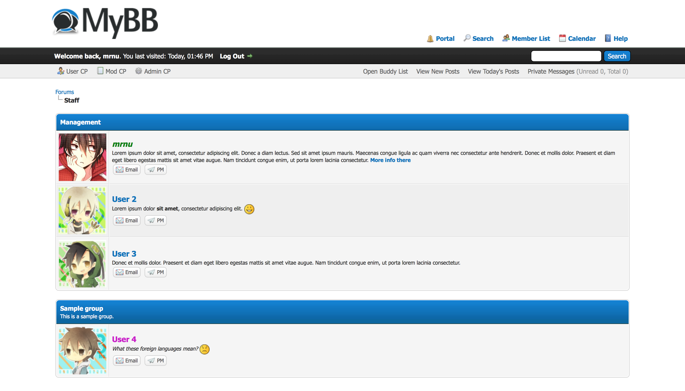
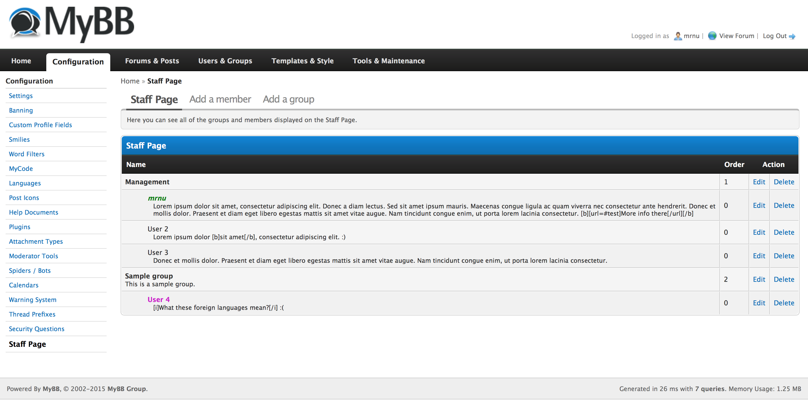

# Staff Page

***[Download](http://github.com/tomaszknapik/staff-page/releases/latest)*** *| [Issues](http://github.com/tomaszknapik/staff-page/issues) | [MyBB Mods page](http://community.mybb.com/mods.php?action=view&pid=395)  | [MyBB Community Forums thread](http://community.mybb.com/thread-167125.html)*

It is a MyBB plugin, which adds a manageable page with list of staff. It creates a list of staff and allows administrators to display members and group them as they like. The page can display description of groups and members set in ACP. Groups displayed on the page are independent from the forum's users groups. In other words, this plugin gives possibility to create a small staff directory, without using MyBB's groups.

*By default this plugin is displayed instead of `showteam.php` page, but the replcamenet can be switched off in the board settings, if you wish to use both of them at once. In this case you will need to add a link to `memberlist.php?action=staff` by yourself, beucase the plugin only adds redirection.*

## Installation
1. Unpack the plugin archive.
2. Upload content of `Upload` folder to your forum's root directory.
3. Go to plugins page in the ACP and install the plugin.

**The page generated by this plugin is available under `memberlist.php?action=staff` URL.**

## Configuration
1. Firstly you must set administrator permissions to gain access to the Staff Page configuration. The permission can be found in the configuration section.
2. Now you can access plugin's configuration page. To do so, go to *Configuration* tab of ACP and choose *Staff Page* from the sidebar on the left. There you can manage your staff page by adding members and grouping them into groups. :fire:

### Groups permissions
You can disallow users from accessing the staff page by setting it in the groups permissions in ACP.

### Board settigs
In the board settings the plugin gives administrators option to set avatar size displayed on the staff page and the redirection from `showteam.php` can be turned off.

## Author
* [tomaszknapik](http://github.com/tomaszknapik) <<tomaszknapik@icloud.com>>

## Information
Project is published under the GPL v3 license.

## Reporting issues
All issues, suggestions, ideas and feedback can be reported on the [issues page](https://github.com/tomaszknapik/staff-page/issues) of this repository. Feel free to do so. :stuck_out_tongue_winking_eye:
